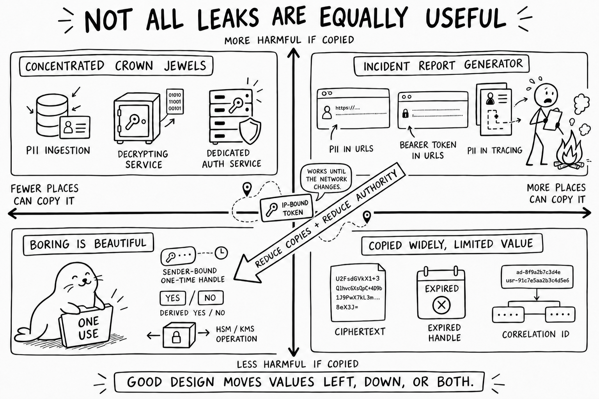

<p align="center">
  
</p>

# Secret Seal: How can I prevent secrets from leaking from an HTTP request?

<p align="center">
  <a href="https://github.com/jasvir/secretseal"></a>
  <a href="https://twitter.com/jasvir"></a>
  <a href="https://www.linkedin.com/in/jasvirnagra/"></a>
</p>

## Leak-resistant browser requests

Browser requests leave more copies behind than most of us realise. A request can pass through browser history, a cache, a service worker, an extension, a CDN, a load balancer, a reverse proxy, a framework, tracing, exception reporting and several log stores before the handler does anything useful with it.

TLS is essential, but it protects the request only while it travels between TLS endpoints. Once an endpoint decodes it, the request can be copied, indexed or logged like any other data. URLs turn up in histories and access logs. Credential headers turn up in request dumps. Custom headers evade redaction. Cookies are stored on purpose. Fragments are visible to page code. Bodies are often captured when something goes wrong.

So the useful question is not *where can I put a secret so that it cannot leak?* It is *which part of the request is least likely to leak for this threat model, and what else do I need to do?*

For the short version, go directly to the [list of request carriers and their leakage pitfalls](#summary-table).

This guide is about accidental persistence and disclosure. A fully compromised browser or origin is a different problem: malicious code running with the application's authority can usually read the same data or make the application use its credentials.

> Treat every part of an HTTP request as potentially observable. Some parts are still much less accident-prone than others.

There are two useful ways to improve a design: reduce the number of places that can copy a value, and reduce what a copied value is worth. The figure shows both.



## Relationship to the OWASP Top 10

The [OWASP Top 10:2025](https://owasp.org/Top10/2025/0x00_2025-Introduction/) covers this problem, but in pieces:

- [A02: Security Misconfiguration](https://owasp.org/Top10/2025/A02_2025-Security_Misconfiguration/) includes insecure cookie configuration and excessive error detail.
- [A04: Cryptographic Failures](https://owasp.org/Top10/2025/A04_2025-Cryptographic_Failures/) covers missing or inadequate encryption, leaking cryptographic keys, and determining when sensitive data requires application-layer protection in addition to TLS.
- [A06: Insecure Design](https://owasp.org/Top10/2025/A06_2025-Insecure_Design/) maps weaknesses involving sensitive browser caches, persistent cookies containing sensitive information, and sensitive values in GET query strings.
- [A07: Authentication Failures](https://owasp.org/Top10/2025/A07_2025-Authentication_Failures/) warns against exposing session identifiers in URLs or other insecure client-visible locations and recommends secure, server-managed sessions.
- [A09: Security Logging and Alerting Failures](https://owasp.org/Top10/2025/A09_2025-Security_Logging_and_Alerting_Failures/) explicitly includes placing sensitive information such as PII or protected health information in logs.
- [A10: Mishandling of Exceptional Conditions](https://owasp.org/Top10/2025/A10_2025-Mishandling_of_Exceptional_Conditions/) includes sensitive information in error messages and debugging output.

Earlier editions named the outcome more directly: [A3:2017 Sensitive Data Exposure](https://owasp.org/www-project-top-ten/2017/A3_2017-Sensitive_Data_Exposure). The newer structure is organised around causes. That makes sense for classification, but it is less helpful when the immediate question is whether a value belongs in a header, cookie, body, fragment or URL.

The supporting cheat sheets give sound advice: [keep credentials out of URLs](https://cheatsheetseries.owasp.org/cheatsheets/REST_Security_Cheat_Sheet.html#sensitive-information-in-http-requests), [exclude sensitive values from logs](https://cheatsheetseries.owasp.org/cheatsheets/Logging_Cheat_Sheet.html#data-to-exclude), and [make session identifiers opaque](https://cheatsheetseries.owasp.org/cheatsheets/Session_Management_Cheat_Sheet.html#session-id-content-or-value). What they do not give us is one comparison of all the places a request value can be copied: URLs, standard and custom headers, cookies, fragments, bodies, caches, errors, tracing and observability systems.

That narrower comparison is what this guide is for. It complements the OWASP material rather than replacing it.

## Summary table

These ratings describe common defaults, not protocol guarantees. Configuration can make any row worse. A linked seal, [🦭](#authorization), takes you to the longer discussion.

| Carrier | Browser persistence or history | Browser Performance Timeline | Ordinary access logs | Error, debug, and trace capture | Same-origin JavaScript | Potential Exposure | Appropriate use |
| --- | --- | --- | --- | --- | --- | --- | --- |
| `Authorization: Bearer …` [🦭](#authorization) | Low for application-supplied bearer tokens; browser-managed HTTP authentication may be retained separately | Low: the API exposes URLs, not header values | Usually low because many systems recognize it as sensitive | Medium: redaction is common but not universal | High when the application owns the token | First Party Scripts<br>Third Party Scripts<br>Browser Cache/Storage/History<br>CDN/Proxy/TLS termination<br>Tracing/Debugging/Extensions<br>Logging at Origin<br>Downstream Services | Short-lived, scoped API credentials |
| `Cookie` with `Secure; HttpOnly; SameSite` [🦭](#cookies) | High by design: the browser stores it | Low: the API does not expose cookie values | Usually low, but highly configuration-dependent | Medium: full request dumps may include it | Low for directly reading an `HttpOnly` value; high for causing authenticated requests | Browser Cache/Storage/History<br>CDN/Proxy/TLS termination<br>Tracing/Debugging/Extensions<br>Logging at Origin<br>Downstream Services | Opaque browser session identifiers |
| `Proxy-Authorization` | Low | Low: the API does not expose the header value | Usually low at the origin; visible to the authenticating proxy | Medium | Usually low | CDN/Proxy/TLS termination<br>Tracing/Debugging/Extensions | Proxy authentication only; never repurpose it |
| Custom secret header such as `X-API-Key` [🦭](#custom-secret-headers) | Low unless application code persists the value | Low: the API exposes URLs, not header values | Usually low in traditional access-log formats | Medium–high because generic redactors may not recognize it | High | First Party Scripts<br>Third Party Scripts<br>Browser Cache/Storage/History<br>CDN/Proxy/TLS termination<br>Tracing/Debugging/Extensions<br>Logging at Origin<br>Downstream Services | Machine or API credentials when `Authorization` cannot be used |
| Request body [🦭](#request-bodies) | Usually low in browser history and HTTP caches | Low: the API does not expose the body | Usually low in traditional access logs | High in practice, especially on errors | High | First Party Scripts<br>Third Party Scripts<br>CDN/Proxy/TLS termination<br>Tracing/Debugging/Extensions<br>Logging at Origin<br>Downstream Services | Necessary PII or structured sensitive input, with minimization and redaction |
| URL fragment [🦭](#url-fragments) | High until removed; may enter history and history sync | High when retained in a navigation or resource entry; browser-dependent | Low, but not zero in operational reality | Medium in browser telemetry and page-level error reports | Very high | First Party Scripts<br>Third Party Scripts<br>Browser Cache/Storage/History<br>Tracing/Debugging/Extensions<br>Downstream Services | Narrow, isolated bootstrap and split-knowledge designs only |
| URL path or query string [🦭](#url-paths-and-query-strings) | Very high | Very high: navigation and resource entries expose request URLs | Very high | Very high | Very high | First Party Scripts<br>Third Party Scripts<br>Browser Cache/Storage/History<br>CDN/Proxy/TLS termination<br>Tracing/Debugging/Extensions<br>Logging at Origin<br>Downstream Services | Non-sensitive routing and filtering values only |
| `Referer`, `User-Agent`, `Forwarded`, or `X-Forwarded-For` | Medium | Low: these request headers are not exposed | Very high | High | Varies | First Party Scripts<br>Third Party Scripts<br>Browser Cache/Storage/History<br>CDN/Proxy/TLS termination<br>Tracing/Debugging/Extensions<br>Logging at Origin<br>Downstream Services | Protocol metadata only; never repurpose for secrets |
| Tracing `baggage` or similar context [🦭](#tracing-and-baggage) | Usually low | Low unless copied into a URL | High across downstream telemetry | Very high by design | High when created in the browser | First Party Scripts<br>Third Party Scripts<br>CDN/Proxy/TLS termination<br>Tracing/Debugging/Extensions<br>Logging at Origin<br>Downstream Services | Non-sensitive correlation metadata only |

“Low” does not mean “safe.” It means that the value is less likely to appear in that particular sink under conventional defaults.

## Why caching is only part of the problem

[RFC 9111](https://www.rfc-editor.org/rfc/rfc9111.html) defines an HTTP cache key as, at minimum, the request method and target URI. In practice, most caches focus on `GET` responses and use the URI as the main key. A response can add request headers to cache matching through `Vary`.

Sensitive headers should therefore never be named in `Vary`:

```http
Vary: X-API-Key  # unsafe design
```

The cache now has to retain enough information to distinguish the original header values. `Authorization` does not need to appear in `Vary`; authenticated requests already have special shared-cache rules.

For a sensitive exchange, both requests and responses can use:

```http
Cache-Control: no-store
```

For Fetch, the corresponding client instruction is:

```js
await fetch(url, {
  cache: "no-store",
  headers: { Authorization: `Bearer ${token}` },
});
```

`no-store` tells compliant private and shared caches not to store this request or response. RFC 9111 explicitly warns that it is not a privacy mechanism. It says nothing about application logs, exception reports, traces, packet capture, extensions or a compromised intermediary. `private` is weaker again: it still permits storage in a browser cache.

HTTP/2 HPACK and HTTP/3 QPACK compression tables are separate from response caches. HPACK has a “never indexed” representation for sensitive fields and names `Cookie` and `Authorization` as examples, but the implementation has to use it. Treat this as defence in depth, not a security boundary.

## What actually gets logged

Traditional access logs usually record the request line—which contains the URL—plus the referrer and user agent. The standard [nginx combined log format](https://nginx.org/en/docs/http/ngx_http_log_module.html), for example, does not include arbitrary request headers or the body. That gives `Authorization`, cookies, custom headers and bodies lower *default access-log* exposure than URLs.

The advantage often disappears elsewhere. Exception middleware, debug logging, API gateways, request inspectors and error-reporting tools have a habit of serialising the complete request when something fails. Some systems do it for ordinary structured logs too. A common half-fix is to redact `Authorization` while keeping cookies, unfamiliar headers, parsed form fields and the whole body.

The [OWASP Logging Cheat Sheet](https://cheatsheetseries.owasp.org/cheatsheets/Logging_Cheat_Sheet.html) says to remove, mask, hash, sanitise or encrypt access tokens, session identifiers, keys and sensitive personal data instead of recording them directly. Good advice, but not a safe assumption about a system you have not inspected. Treat bodies and unrecognised headers as loggable.

Observability has the same problem. The [OpenTelemetry HTTP semantic conventions](https://opentelemetry.io/docs/specs/semconv/registry/attributes/http/) recommend explicitly choosing which headers to capture because “capture everything” can disclose sensitive data.

Even well-redacted logs are security-sensitive. Restrict and audit access, protect their integrity, and set real retention and deletion periods. “It might be useful later” is not enough reason to keep personal data indefinitely; harmless-looking identifiers can become identifying when they are combined.

## Authorization

`Authorization` is usually the least accident-prone header for a bearer credential because the surrounding ecosystem knows what it means:

- HTTP caching gives authenticated requests special shared-cache treatment.
- HTTP header-compression implementations can treat it as never-indexed.
- Proxies, frameworks, and observability products frequently include it in default redaction lists.
- [RFC 6750](https://www.rfc-editor.org/rfc/rfc6750.html) recommends the `Authorization` header for OAuth bearer tokens and warns against putting bearer tokens in page URLs.

Those conventions help, but they are not confidentiality guarantees. Every TLS endpoint and application layer that sees the decoded request can still read the header. So can a full request dump, a badly configured trace exporter or a custom proxy.

Bearer credentials should be short-lived, audience-restricted, narrowly scoped, and replaceable. A cryptographic private key should not be transmitted in `Authorization` or anywhere else in an HTTP request.

## Cookies

For a browser session, an opaque cookie with `Secure`, `HttpOnly` and an appropriate `SameSite` setting is usually better than giving JavaScript an API token. `HttpOnly` stops ordinary page scripts reading the cookie; it does not stop them making authenticated requests through the browser.

Cookies are stored by design and sent automatically to matching destinations. Expect to find them in browser profiles, backups, developer tools, endpoint inspection products, privileged extensions, proxies and server-side request dumps. Keep the value opaque; raw PII does not belong in it. The `__Host-` prefix can narrow a session cookie's scope further.

For browser OAuth clients, [RFC 10017](https://www.rfc-editor.org/rfc/rfc10017.html) presents a backend-for-frontend (BFF) as the strongest of its principal architecture patterns: OAuth tokens remain at the backend and the browser holds only a cookie-backed session. Malicious page code can still act through the user's browser, but it cannot directly extract the backend tokens.

## Custom secret headers

A custom header such as `X-API-Key` avoids browser history, referrer propagation and conventional request-line logging. It may still be worse than `Authorization`: generic infrastructure has no reason to recognise your header as sensitive.

Every custom credential header should be registered with redaction policy at all of the following layers:

- browser or frontend telemetry;
- CDN and edge request logging;
- load balancers and reverse proxies;
- application request and error serializers;
- distributed tracing and APM;
- support tooling and request replay systems.

A custom secret header must not be included in `Vary`. Cross-origin use also causes a CORS preflight in ordinary Fetch configurations; the preflight exposes the header name, not its value.

## Request bodies

A request body avoids the browser-history, referrer and conventional access-log problems of a URL. HTTP caches mainly store responses, and a `POST` response is not normally keyed by the request body.

In practice, bodies are logged surprisingly often. Frameworks parse them into convenient objects, then exception handlers and structured loggers serialise those objects. Validation failures are a particular trap: the bad input is attached to the error because it is useful for debugging. A proxy or APM agent may also capture the raw body before application redaction runs.

Necessary PII belongs in a body rather than in a URL or arbitrary header, but it should still be minimized. Schemas should classify sensitive fields, and log serializers should operate on an allowlisted safe view rather than serializing the parsed request and deleting a few known keys afterward.

Application-layer encryption can keep selected body fields opaque to CDNs, TLS-terminating gateways, and early request logging. It does not help after decryption unless the resulting value retains its sensitive classification throughout the application.

## URL fragments

Under the URI, HTTP, and Referrer Policy specifications, the fragment is interpreted by the client. A conforming browser does not include it in the HTTP request target or in the `Referer` header.

The specification is clear; real systems are messier. Fragment values sometimes reach servers through embedded or nonconforming user agents, extensions, native wrappers, analytics, error telemetry, or client code that copies `location.href` or `location.hash` into another request. Treat a fragment as *unlikely* to reach ordinary server infrastructure, not as cryptographically prevented from doing so.

Every script on the page can read the fragment through `window.location`. It can also appear in browser history, synced history, copied URLs, screenshots, crash reports, session replay and extension APIs. OAuth's former Implicit flow returned access tokens in fragments; [RFC 10017 now prohibits that flow](https://www.rfc-editor.org/rfc/rfc10017.html#section-7.2), in part because third-party or malicious page code can read the token.

When a fragment is used for a narrowly scoped bootstrap value, it should be removed before third-party code loads:

```html
<script>
  const bootstrapValue = location.hash.slice(1);
  history.replaceState(null, "", location.pathname + location.search);
</script>
```

This should be the first executable code on a small, isolated landing page. Do not load third-party scripts or redirect first. Use a strict Content Security Policy and discard the value as soon as possible. `replaceState` reduces later exposure; it cannot undo an earlier capture.

### Performance Timeline retains request URLs

Removing a fragment from `window.location` and history does not necessarily remove it from the Performance Timeline. [Navigation Timing](https://w3c.github.io/navigation-timing/#marking-navigation-timing) creates an entry from the document URL, while [Resource Timing](https://w3c.github.io/resource-timing/#sec-performanceresourcetiming) stores requested resource URLs. The [history update steps](https://html.spec.whatwg.org/dev/browsing-the-web.html#url-and-history-update-steps) used by `history.replaceState` do not rewrite entries that already exist.

Same-origin code that runs later may therefore be able to recover an initial navigation URL or the URLs of earlier Fetch, XHR, image, script, and other resource requests:

```js
const initialURL = performance.getEntriesByType("navigation")[0]?.name;
const resourceURLs = performance
  .getEntriesByType("resource")
  .map(entry => entry.name);
```

The Performance APIs expose URLs and timing, not headers or bodies. They will not reveal `Authorization`, a cookie or a body field unless somebody also put that value in a URL. Fragment handling varies between browsers, especially for special fragment directives, so assume an ordinary fragment may remain in a navigation or resource entry after visible cleanup.

`performance.clearResourceTimings()` removes buffered resource entries, but there is no equivalent for the current navigation entry. Nor can clearing retract a value already copied by a `PerformanceObserver`, analytics library, tracing client, extension or earlier script.

If later code must not recover the bootstrap URL, run the bootstrap in an isolated document and then load a genuinely new document whose initial URL never contained the fragment. Do that before introducing analytics, logging, tracing or other nonessential code. Replacing the fragment in the same document is not enough.

This is why I would not describe a fragment as a leak-proof home for PII or reusable credentials. At most, use one for a narrow, short-lived, single-use bootstrap value or decryption key, and include its possible disclosure in the threat model.

### Fragment-held decryption keys

In a split-knowledge design, the server-visible location holds ciphertext and the fragment holds its key. The server, CDN and conventional request logs see ciphertext; the page decrypts it locally.

A framework implementing this pattern should provide:

- authenticated encryption rather than unauthenticated encryption;
- a fresh high-entropy key for each payload;
- expiry and replay protection;
- immediate fragment removal;
- an isolated bootstrap document with no third-party code;
- a transition to a new clean document before loading less-trusted application or telemetry code, when the original navigation URL must no longer be observable;
- explicit binding of the ciphertext to its intended origin and purpose;
- zero plaintext logging after decryption.

This keeps plaintext out of server-side caches and early logs. It does nothing about history capture before cleanup, malicious same-origin JavaScript, extensions, a compromised browser profile or code that sees the decrypted value. If the original URL contains enough information to recover both ciphertext and key, anyone with that URL can decrypt the PII.

## URL paths and query strings

Paths and query strings have the widest accidental-disclosure surface. They turn up in:

- browser history and history synchronization;
- bookmarks, copied links, screenshots, and support tickets;
- CDN, load-balancer, proxy, and web-server access logs;
- cache keys;
- analytics and session-replay products;
- same-origin `Referer` headers and, under weaker policies, cross-origin referrers;
- metrics labels and error messages;
- allowlists, blocklists, and security-product event stores.

The default referrer policy, `strict-origin-when-cross-origin`, still sends the full path and query on same-origin requests. `Referrer-Policy: no-referrer` limits that propagation, but none of the other copies disappear.

URLs should contain opaque, short-lived, single-use handles rather than PII or bearer credentials. [RFC 9700](https://www.rfc-editor.org/rfc/rfc9700.html#section-4.3) discusses even short-lived OAuth authorization codes as a browser-history exposure and relies on replay prevention and prompt cleanup.

## Tracing and baggage

Tracing is designed to copy context across process boundaries. That makes its metadata a particularly bad place for sensitive data.

OpenTelemetry baggage may be forwarded automatically to downstream services and copied again into spans, metrics and logs. Its [security guidance](https://opentelemetry.io/docs/concepts/signals/baggage/#baggage-security-considerations) warns that baggage can reach unintended resources, including third-party APIs. Keep credentials, user identifiers, email addresses, health information and other PII out of `baggage`, `tracestate`, correlation headers and metric labels.

## Nonces, single-use tokens, and opaque handles

These terms are often used as though they were interchangeable. They are not.

- A **nonce** proves freshness, but only when it is part of an authenticated request or proof. It is not secret and does not authenticate anything on its own. It may not even be literally single-use: DPoP, for example, can reuse a server nonce while rejecting duplicate proof identifiers.
- A **single-use opaque handle** points to server-side state or permits one narrow operation without carrying the PII itself. That makes a logged copy less revealing. Until it is redeemed or expires, however, an unbound handle is still a bearer credential and an attacker may win the race to use it.
- A **sender-bound token** also requires proof from the expected user, client or browser-held key. A stolen token is then less portable. Malicious code already running in the authorised browser may still invoke the key or make the browser send the request; [RFC 9449](https://www.rfc-editor.org/rfc/rfc9449.html#section-11.4) calls out this DPoP limitation.
- **Encryption** hides a value from early intermediaries. It does not hide it from the browser that collected it or the service that decrypts it.
- A **zero-knowledge proof** can reveal a fact without revealing the source value, but only when the application needs the fact and not the data itself.

All of these techniques either make a leak less useful or reduce where plaintext appears. None makes leakage impossible.

### A practical redemption model

A useful one-time handle is random, short-lived and deliberately boring. It has one job:

1. Generate it without embedding PII, credentials, account numbers or business meaning.
2. Bind it to the expected subject or session, action, audience and expiry. Add a browser-held public key where the extra friction is justified.
3. Bind the proof to the request method and destination. For a high-value operation, bind the content too, so the same proof cannot authorise a different payload. [HTTP Message Signatures](https://www.rfc-editor.org/rfc/rfc9421.html) and a content digest are useful building blocks.
4. Redeem it atomically for one logical operation and return only the result it authorises.
5. Keep a non-reversible audit fingerprint and just enough state to make retries safe.
6. Treat reuse as a possible leak or replay.

Do not confuse “single-use” with “one HTTP delivery attempt”. Browsers, proxies and applications retry, and a successful response can be lost. An identical retry should recover the first result without repeating the side effect; a changed payload or action should fail. This gets awkward across replicas, concurrent tabs, partial failures and expiry, which is why it belongs in shared infrastructure rather than every handler.

Store a hash instead of the redeemable handle when a hash is enough. And do not put the handle in a URL merely because it is opaque. Before redemption it may still be a credential, with all the usual history, logging, referrer and telemetry problems.

### Binding trade-offs

- **User or session:** usually the least surprising default. It stops a different account redeeming the handle, but not an attacker who also has the session.
- **Browser or device key:** better against off-device replay. DPoP can use a non-extractable browser key, although injected code can still ask that key to sign. Plan for device reset, lost storage, cross-device journeys, accessibility tools and account recovery.
- **IP address:** useful as a signal, brittle as a lock. Mobile networks, VPNs, IPv6 address changes, corporate proxies and carrier-grade NAT can move an honest user or put many users behind one address. An attacker may even share the victim's apparent address. [OWASP's session guidance](https://cheatsheetseries.owasp.org/cheatsheets/Session_Management_Cheat_Sheet.html#binding-the-session-id-to-other-user-properties) makes the same distinction. Take any IP signal from a trusted network boundary, not an arbitrary forwarding header.
- **Purpose, action, audience, method and destination:** strong and relatively cheap. A handle for submitting a form should not retrieve the resulting record or call another service.
- **Delegate:** issue a new, narrower token bound to the delegate instead of forwarding the original. [RFC 8693](https://www.rfc-editor.org/rfc/rfc8693.html) defines token-exchange patterns for delegation and impersonation. Without an exchange path, hard binding can make legitimate delegation impossible.

### When the browser gathers the PII

Tokenisation cannot replace data the server has never received. If somebody enters PII in a browser, there is still an initial plaintext collection step. Keep that path as narrow as possible:

1. Issue a one-time submission handle for the form, user or session, schema and action.
2. Collect only the PII needed for that action.
3. Send it in the body to a dedicated ingestion service, using the handle for authorisation and correlation.
4. Where the risk warrants it, encrypt selected fields for that service in the browser. The CDN, TLS terminator, gateway and early logs then see ciphertext.
5. Validate and store the data, consume the submission handle, and return a different opaque record handle.
6. Pass that record handle through later systems instead of copying the PII again.

The submission handle limits who can submit, what they can do and whether the action can be replayed. It does not hide data already sitting in form controls or JavaScript memory. First-party code, third-party code running with first-party authority, extensions and a compromised page can all see the PII before encryption. WebCrypto does not change this; its [security considerations](https://www.w3.org/TR/WebCryptoAPI/#security-considerations-for-authors) warn that injected script can expose keys or data and that an application can read the messages it processes.

For especially sensitive collection, use a small isolated page without analytics, session replay, advertising, tag managers or other nonessential code. A strict Content Security Policy and field encryption help, but neither protects plaintext from malicious code that already has the page's authority.

### The eventual point of exposure

Sooner or later the PII has to be evaluated, displayed, delivered or otherwise used. If not, there was little reason to collect it. Tokenisation does not remove this *revelation boundary*; it reduces how many systems cross it.

The resolver should return only what the caller needs. Often that is “age requirement satisfied”, “account verified” or “delivery permitted”, not the whole record. This is ordinary data minimisation; it does not require a zero-knowledge proof. Zero-knowledge techniques help when a verifier can act on a fact alone. They do not help when the source data is genuinely needed for delivery, treatment, investigation or support.

Private keys are a useful exception to “the data must eventually be revealed”. A key may need to sign or decrypt without ever leaving an HSM, KMS or tightly scoped service.

This leaves fewer plaintext leak points, but each one matters more. The ingestion service, resolver, PII store, authorised consumers and key-use service become the crown jewels. Give them strict access control, purpose limits, safe request representations, schema-derived redaction, short retention and leak-canary tests. Remember that an opaque handle may itself be personal data if it can be linked back to a person.

This buys us fewer meaningful copies and easier expiry, replay detection and revocation. The cost is server-side state, a resolution dependency, awkward retries, recovery friction, harder delegation and a high-value vault. Authority and plaintext have been contained, not abolished.

## What the framework should do

Picking a better request carrier helps, but most leaks happen across the whole path. These protections are difficult to implement correctly in every handler, so they should live in shared infrastructure.

### 1. Sensitivity-aware values and taint propagation

Represent sensitive data as a distinct runtime and type-system value, not an ordinary string:

```ts
const email = Sensitive.pii(input.email);
const token = Sensitive.credential(accessToken);

logger.info({ email });                    // emits "[REDACTED]"
url.searchParams.set("email", email);      // compile-time or runtime error
request.setBaggage("token", token);        // error
request.json({ email });                   // allowed by an explicit route policy
```

The hard part is keeping the label through parsing, validation, interpolation, exceptions, queues, database objects, RPC boundaries and asynchronous callbacks. Make those transitions part of the framework, and require explicit declassification before a value enters an unsafe sink.

Sensitivity metadata should distinguish at least:

- credentials and session identifiers;
- cryptographic key material;
- direct PII;
- linkable pseudonymous identifiers;
- financial or health data;
- values safe for public logging.

### 2. Schema-derived redaction

Classify fields once in request and response schemas, then generate:

- parser and validator behaviour;
- safe structured-log views;
- trace-attribute allowlists;
- support-tool displays;
- data-retention rules;
- application-layer encryption policies.

This is safer than maintaining a separate list of field names in every logger. Those lists miss aliases such as `secret`, `apiKey`, `credential` and `assertion`, as well as nested values, arrays and secrets buried in free-form strings.

### 3. A safe request representation for logs and errors

Do not give loggers the raw request object. Give them a deliberately lossy representation:

```json
{
  "method": "POST",
  "route": "/users/:id",
  "status": 400,
  "request_bytes": 842,
  "content_type": "application/json",
  "request_id": "…"
}
```

Raw headers and bodies should be unavailable by default, including from exception objects. For correlation, log a keyed HMAC fingerprint rather than the original credential or identifier. Temporary raw capture needs a narrow break-glass policy, short retention, audited access and automatic deletion.

Structurally encode any user-controlled value that does reach a log. Redaction protects confidentiality; encoding stops crafted line breaks or delimiters from forging entries or attacking downstream processors.

### 4. Automatic cache and referrer policy

Sensitive routes should automatically receive:

```http
Cache-Control: no-store
Referrer-Policy: no-referrer
```

Reject contradictory `public` or `s-maxage` directives and sensitive headers named in `Vary`. Disable body capture, keep sensitive values out of cache tags and surrogate keys, and redirect a completed one-time exchange to a clean URL.

### 5. One-time opaque handles

The safest URL value is often a random handle with no meaning outside a short redemption window. Make the [nonce and single-use-token lifecycle](#nonces-single-use-tokens-and-opaque-handles) a primitive: bind the handle, redeem one logical operation safely across retries, exchange it for server-side state or an `HttpOnly` cookie, redirect to a clean URL, and retain only a non-reversible audit fingerprint. Keep concurrency, recovery and replay policy out of individual handlers.

### 6. Application-layer encrypted fields

For especially sensitive bodies, encrypt selected fields before the request reaches the CDN or TLS-terminating gateway. A standard construction such as [HPKE](https://www.rfc-editor.org/rfc/rfc9180.html), used inside a protocol with replay protection and authenticated context, can leave early infrastructure with ciphertext only.

After decryption, recreate sensitivity-aware values rather than ordinary strings, or the first exception may put the plaintext straight back into a log. Keep key rotation, algorithm negotiation, payload binding, replay detection and failure handling in shared code.

### 7. Credential brokers

A server-side BFF can hold API credentials while the browser sees only an opaque session. It should add `Authorization` only for allowlisted resource origins, restrict methods and paths, rate-limit operations, and strip credentials before redirects or error serialisation.

A worker can keep a token out of the main page's JavaScript heap and attach it to requests. That makes direct extraction harder, but it is not a BFF. RFC 10017 notes that service-worker OAuth remains vulnerable to new token acquisition and browser-mediated request proxying, and does not recommend it as the general solution.

### 8. Sender-constrained and per-request credentials

Reduce the value of a copied bearer token with [DPoP](https://www.rfc-editor.org/rfc/rfc9449.html) or another sender constraint, non-exportable WebCrypto keys, short lifetimes, narrow audiences and per-request proofs bound to a method and URL.

This cuts down off-device replay. It does not stop malicious same-origin JavaScript asking the legitimate browser to make requests or obtain fresh credentials. “Non-exportable” means the key bytes cannot be extracted; code with the right privileges can still invoke the key.

### 9. Egress and redirect controls

Enforce an origin-level egress policy below application code. It should:

- strip credentials and sensitive context on cross-origin redirects;
- prevent forwarding `Cookie`, `Authorization`, and custom credentials to unapproved origins;
- remove tracing baggage at trust boundaries;
- require explicit opt-in for credentialed CORS;
- distinguish public telemetry endpoints from trusted application APIs;
- reject attempts to copy a complete current URL into a header, body, or telemetry event.

Putting this below application code means a forgotten Fetch wrapper or a new HTTP client cannot bypass it by accident.

### 10. Leak-canary testing

Inject a unique, non-functional canary into every sensitive carrier, then exercise:

- successful and failing requests;
- validation and parsing errors;
- redirects and authentication challenges;
- retry and timeout paths;
- browser history and storage;
- service workers and offline caches;
- CDN, proxy, application, trace, metric, and error-reporting stores.

Fail the test if a canary appears anywhere it was not declared. Give each carrier a different value so the result identifies the leaking path. Now redaction is an observed property, not a configuration claim.

Leak canaries are not the [honeytokens recommended by OWASP A09](https://owasp.org/Top10/2025/A09_2025-Security_Logging_and_Alerting_Failures/#how-to-prevent). A honeytoken is a trap: unexpected use suggests an attacker. A leak canary is test data: finding it in an undeclared cache, log, trace or error report proves accidental propagation. Both are useful, but they should trigger different responses.

### 11. Retention and deletion orchestration

Once sensitive data reaches logs or telemetry, removing it is harder than preventing collection. Attach retention classes to safe derived events, keep high-sensitivity data out of long-retention stores, record which processors received it, and automate cache and telemetry deletion after an incident.

You cannot guarantee deletion from an unknown intermediary, immutable backup or outside recipient. You can at least reduce how many systems have to be trusted.

## Order of preference

For a new browser application, I would work down this list:

1. Do not transmit the sensitive value at all.
2. Replace it with an opaque, short-lived, single-use server-side handle.
3. Keep API tokens in a BFF and give the browser an opaque `Secure; HttpOnly; SameSite` session cookie.
4. When the browser must call an API directly, use a short-lived, scoped `Authorization` credential held in memory.
5. Put necessary PII in a minimized request body, with schema-derived redaction and, where justified, application-layer field encryption.
6. Use fragments only for deliberately designed, isolated client-side bootstrap or split-knowledge protocols; remove them immediately, account for Performance Timeline retention, and prefer a new clean document before loading other code.
7. Never put credentials or raw PII in paths, query strings, referrers, tracing baggage, metric labels, or cache keys.
8. Never transmit a private cryptographic key merely to authenticate a request; use a proof of possession instead.

## Where this stops helping

None of this protects data that has to be revealed to a compromised page. Malicious same-origin JavaScript can read it, intercept it before protection is applied, replace framework functions or use the browser as an authenticated proxy.

The realistic goal is smaller: give the browser fewer reusable secrets, give every credential less authority and a shorter life, keep raw requests out of observability systems, and make unsafe data movement difficult to do by accident.

## References

- [OWASP Top 10:2025](https://owasp.org/Top10/2025/0x00_2025-Introduction/)
- [OWASP A02:2025 Security Misconfiguration](https://owasp.org/Top10/2025/A02_2025-Security_Misconfiguration/)
- [OWASP A04:2025 Cryptographic Failures](https://owasp.org/Top10/2025/A04_2025-Cryptographic_Failures/)
- [OWASP A06:2025 Insecure Design](https://owasp.org/Top10/2025/A06_2025-Insecure_Design/)
- [OWASP A07:2025 Authentication Failures](https://owasp.org/Top10/2025/A07_2025-Authentication_Failures/)
- [OWASP A09:2025 Security Logging and Alerting Failures](https://owasp.org/Top10/2025/A09_2025-Security_Logging_and_Alerting_Failures/)
- [OWASP A10:2025 Mishandling of Exceptional Conditions](https://owasp.org/Top10/2025/A10_2025-Mishandling_of_Exceptional_Conditions/)
- [OWASP A3:2017 Sensitive Data Exposure](https://owasp.org/www-project-top-ten/2017/A3_2017-Sensitive_Data_Exposure)
- [OWASP REST Security Cheat Sheet](https://cheatsheetseries.owasp.org/cheatsheets/REST_Security_Cheat_Sheet.html)
- [OWASP Session Management Cheat Sheet](https://cheatsheetseries.owasp.org/cheatsheets/Session_Management_Cheat_Sheet.html)
- [RFC 9110: HTTP Semantics](https://www.rfc-editor.org/rfc/rfc9110.html)
- [RFC 9111: HTTP Caching](https://www.rfc-editor.org/rfc/rfc9111.html)
- [RFC 6265: HTTP State Management Mechanism](https://www.rfc-editor.org/rfc/rfc6265.html)
- [RFC 6750: OAuth 2.0 Bearer Token Usage](https://www.rfc-editor.org/rfc/rfc6750.html)
- [RFC 8693: OAuth 2.0 Token Exchange](https://www.rfc-editor.org/rfc/rfc8693.html)
- [RFC 9700: Best Current Practice for OAuth 2.0 Security](https://www.rfc-editor.org/rfc/rfc9700.html)
- [RFC 10017: OAuth 2.0 for Browser-Based Applications](https://www.rfc-editor.org/rfc/rfc10017.html)
- [RFC 7541: HPACK](https://www.rfc-editor.org/rfc/rfc7541.html)
- [RFC 9180: Hybrid Public Key Encryption](https://www.rfc-editor.org/rfc/rfc9180.html)
- [RFC 9421: HTTP Message Signatures](https://www.rfc-editor.org/rfc/rfc9421.html)
- [RFC 9449: OAuth 2.0 Demonstrating Proof of Possession](https://www.rfc-editor.org/rfc/rfc9449.html)
- [W3C Web Cryptography API](https://www.w3.org/TR/WebCryptoAPI/)
- [W3C Referrer Policy](https://www.w3.org/TR/referrer-policy/)
- [W3C Navigation Timing](https://w3c.github.io/navigation-timing/)
- [W3C Resource Timing](https://w3c.github.io/resource-timing/)
- [W3C Performance Timeline](https://w3c.github.io/performance-timeline/)
- [WHATWG HTML history](https://html.spec.whatwg.org/dev/browsing-the-web.html#history)
- [OWASP Logging Cheat Sheet](https://cheatsheetseries.owasp.org/cheatsheets/Logging_Cheat_Sheet.html)
- [OpenTelemetry HTTP semantic conventions](https://opentelemetry.io/docs/specs/semconv/registry/attributes/http/)
- [OpenTelemetry baggage security considerations](https://opentelemetry.io/docs/concepts/signals/baggage/#baggage-security-considerations)
